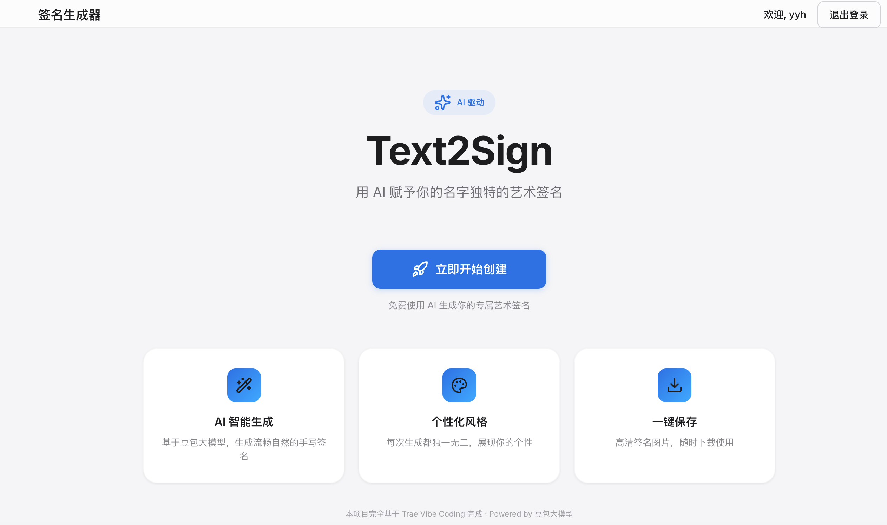
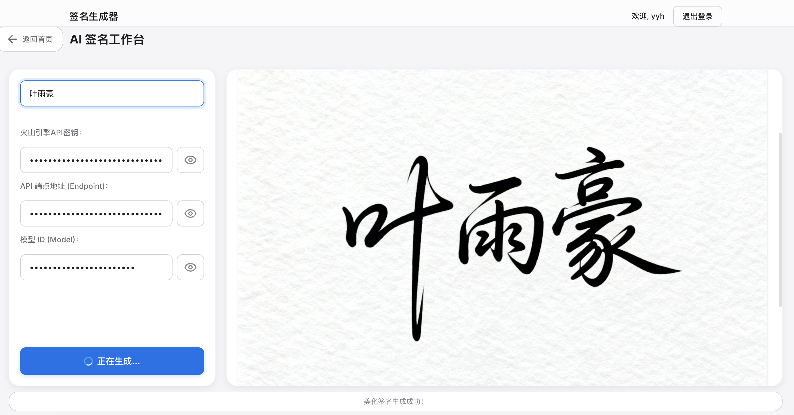

<div align="center">

# TEXT2SIGN

**Doubao LLM Personalized Signature Generator**

[](https://www.volcengine.com/)
[](https://www.trae.ai)
[](https://opensource.org/licenses/MIT)

[中文文档](README.md)

</div>

---

### 📖 Introduction

**TEXT2SIGN** is a full-stack web application with a separated frontend and backend. By simply typing your name, it seamlessly integrates with the **Volcengine SeedDream Large Model** to generate an artistic, highly personalized handwritten signature image.

> 💡 **This project is completely built based on Trae Vibe Coding.**

The frontend is built with vanilla HTML/CSS/JS following Apple's design language, while the backend is powered by Express + MySQL, providing user authentication and API Key management services.

### 📸 Screenshot

<p align="center">
  
</p>
<p align="center">
  
</p>

### 🏗️ Project Architecture

```
text2sign/
├── index.html              # Frontend main page
├── src/
│   ├── css/style.css       # Frontend styles (Apple Design System)
│   └── js/script.js        # Frontend logic (SPA routing + state management)
├── backend/
│   ├── index.js            # Express backend service
│   ├── db.js               # MySQL connection pool
│   ├── package.json        # Backend dependencies
│   └── .env.example        # Environment variable template
└── README.md
```

### 🚀 Features

- **🍎 Apple-style UI**: Apple color palette, frosted glass navbar, rounded cards, refined shadows, smooth animations, and full-screen immersive layout.
- **🔀 SPA Multi-view Navigation**: Home view (Hero + CTA + Feature showcase) and Signature Workspace, with URL hash routing and browser back/forward support.
- **🔐 User Authentication**: Registration/login with bcrypt password hashing and JWT token authentication.
- **🔑 API Key Management**: Bind your Volcengine API Key securely on the server side, auto-loaded after login.
- **⌨️ Simple Input**: Type your name to generate a signature, with Enter key shortcut support.
- **🎨 AI-Powered**: Integrates with Volcengine's SeedDream model to generate high-quality, fluent handwritten styles with a white background and black text.
- **⚙️ Advanced Settings**: Customize API endpoint and model ID, each field with show/hide toggle, flexibly adapting to different model versions.
- **💾 One-Click Save**: Download your generated signature instantly for use in digital documents, business cards, etc.
- **🖼️ Split-panel Workspace**: Left panel for input configuration + Right panel for result preview, keeping operations and results in clear view.
- **🔄 Loading State Feedback**: Button loading animations and real-time status bar updates for clear operation progress.
- **✨ Lucide Icons**: Consistent, professional iconography throughout the app using the Lucide icon library.

### 🛠️ Getting Started

#### Frontend (Static)

1. **Clone the repository**
   ```bash
   git clone https://github.com/YuhaoYeSteve/text2sign.git
   ```
2. **Run the frontend**
   - Simply double-click `index.html` in the root directory, or use the VS Code Live Server extension for a better experience.
   - The frontend uses localStorage for user data management and can run without the backend.

#### Backend (Optional, for server-side user management)

1. **Install backend dependencies**
   ```bash
   cd backend
   npm install
   ```
2. **Configure environment variables**
   ```bash
   cp .env.example .env
   # Edit .env file with your database connection info and JWT secret
   ```
3. **Ensure MySQL is running and create the database**
   ```sql
   CREATE DATABASE text2sign;
   ```
4. **Start the backend server**
   ```bash
   npm start
   ```
   The server runs on `http://localhost:3000` by default.

#### Generate & Save

1. Click **"Start Creating Now"** on the home page to enter the Signature Workspace.
2. Register/Login to your account (login modal appears automatically if not logged in).
3. Enter your [Volcengine API Key](https://console.volcengine.com/) in the settings.
4. Type your name and click **"Generate Beautiful Signature"** (or press Enter).
5. Once generated, click **"Save Signature"** to download the image.

### 🔧 Backend API

| Endpoint | Method | Description | Auth |
|----------|--------|-------------|------|
| `/register` | POST | User registration | ❌ |
| `/login` | POST | User login | ❌ |
| `/api_key` | GET | Get bound API Key | ✅ JWT |
| `/api_key` | POST | Update bound API Key | ✅ JWT |

### 📄 License
This project is licensed under the [MIT License](LICENSE).
